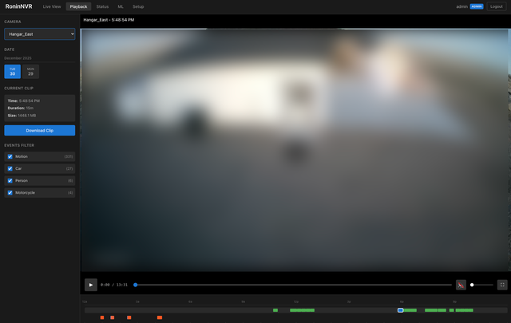
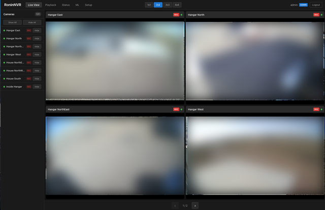
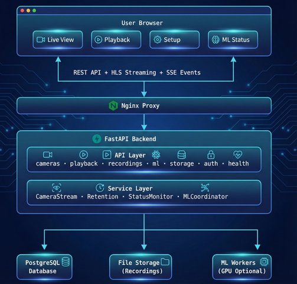

# Ronin NVR

## Summary

Ronin NVR is a self-hosted Network Video Recorder designed to replace commercial surveillance systems. It provides multi-camera recording, live streaming, timeline-based playback, and ML-powered object detection. The system is built with a Python/FastAPI backend, React frontend, and PostgreSQL database, all orchestrated via Docker with optional GPU acceleration.

**Key Capabilities:**
- 24/7 continuous recording from IP cameras via RTSP
- Low-latency live streaming (3-5 seconds) via HLS
- Calendar-based timeline playback with seeking
- YOLO-based object detection (people, vehicles, animals)
- Real-time detection alerts with debouncing
- Automatic storage retention management
- H.265 transcoding for storage optimization

---





## System Architecture

### High-Level Component Diagram



### Technology Stack

| Layer | Technology |
|-------|------------|
| Frontend | React 19, TypeScript, Vite, HLS.js |
| Backend | Python 3.11+, FastAPI, SQLAlchemy 2.0 |
| Database | PostgreSQL 16+ with asyncpg |
| Video | FFmpeg 5.x, RTSP, HLS |
| ML | ONNX Runtime, YOLO models, OpenCV |
| Deployment | Docker, Docker Compose, Nginx |

---

## Core Subsystems

### 1. Camera Management

**Purpose:** Configure and manage IP camera connections.

**Location:** `backend/app/api/cameras.py`, `backend/app/services/camera.py`

**Responsibilities:**
- Store camera configurations (host, port, credentials, stream paths)
- Encrypt sensitive credentials at rest using Fernet encryption
- Validate RTSP connectivity before saving
- Provide camera status (online, offline, recording)
- Support camera grouping and ordering

**Data Flow:**
1. Admin adds camera via Setup page
2. Backend validates RTSP connection
3. Credentials encrypted and stored in database
4. Camera appears in live view grid

### 2. Video Streaming

**Purpose:** Deliver live camera feeds to browsers with low latency.

**Location:** `backend/app/services/camera_stream.py`, `backend/app/services/streaming.py`

**Design Decision:** Each camera uses a single FFmpeg process with dual outputs—one for live HLS streaming and one for MP4 recording. This avoids opening multiple RTSP connections to the same camera.

**Architecture:**
```
IP Camera (RTSP)
      │
      ▼
┌─────────────────────────────────────────────┐
│            FFmpeg Process                   │
│  Input: rtsp://camera/stream                │
│  ┌─────────────────┬──────────────────────┐ │
│  │ Output 1: HLS   │ Output 2: MP4        │ │
│  │ 2-sec segments  │ 15-min segments      │ │
│  │ 10-seg playlist │ Continuous recording │ │
│  └────────┬────────┴──────────┬───────────┘ │
└───────────┼───────────────────┼─────────────┘
            ▼                   ▼
    .streams/{id}/        {Name}/{date}/
    └── stream.m3u8       └── HH-MM-SS.mp4
```

**Key Characteristics:**
- **Transmuxing only:** Copies video codec without re-encoding (low CPU)
- **Audio transcoding:** Converts to AAC for browser compatibility
- **Auto-reconnect:** Exponential backoff up to 10 attempts
- **Latency:** 3-5 seconds (2-second segments + buffering)

### 3. Recording System

**Purpose:** Continuously record camera streams to disk.

**Location:** `backend/app/services/recorder.py`, `backend/app/models/recording.py`

**Storage Organization:**
```
storage/
├── {CameraName}/
│   └── {YYYY-MM-DD}/
│       ├── 00-00-00.mp4   # 15-minute segments
│       ├── 00-15-00.mp4
│       └── ...
└── .streams/              # Live HLS segments (ephemeral)
```

**Workflow:**
1. FFmpeg writes continuous MP4 segments (default: 15 minutes)
2. On segment completion, metadata stored in database
3. Recording includes: start/end timestamps, file path, size, duration
4. Retention monitor periodically removes old recordings

### 4. Playback System

**Purpose:** Browse and view historical recordings.

**Location:** `backend/app/api/playback.py`, `backend/app/services/playback.py`

**Features:**
- Calendar-based date navigation
- 24-hour timeline visualization
- Click-to-seek within segments
- Cross-segment time range export
- HTTP range requests for efficient seeking

**Data Flow:**
1. User selects date via calendar picker
2. Backend returns list of recordings for that date
3. Timeline displays segment bars on 24-hour ruler
4. User clicks segment; player loads MP4 stream
5. Detection markers overlay on timeline

### 5. Storage Retention

**Purpose:** Automatically manage disk space by removing old recordings.

**Location:** `backend/app/services/retention.py`

**Strategies:**
- **Age-based:** Delete recordings older than N days
- **Size-based:** Delete oldest when storage exceeds threshold
- **Combined:** Apply both policies

**Operation:**
- Runs as background task in main process
- Checks periodically (configurable interval)
- Deletes database records and filesystem files atomically
- Logs deletions for audit trail

### 6. Authentication & Security

**Purpose:** Protect system access and secure stored credentials.

**Location:** `backend/app/api/auth.py`, `backend/app/services/auth.py`, `backend/app/services/encryption.py`

**Components:**
- **User authentication:** JWT tokens with configurable expiry
- **Credential encryption:** Fernet symmetric encryption for camera passwords
- **Rate limiting:** Prevent brute-force attacks
- **CORS:** Configured for frontend origin

**Note:** HLS streaming endpoints are unauthenticated because browser video elements cannot send Authorization headers. Access control relies on page-level authentication.

---

## ML Detection System

### Overview

The ML system provides object detection capabilities through two complementary modes:

| Mode | Purpose | Latency | Coverage |
|------|---------|---------|----------|
| Historical | Analyze completed recordings | Minutes | Complete |
| Live | Real-time alerts | Seconds | Sampling |

### ML Architecture

```
┌─────────────────────────────────────────────────────────────────┐
│                    ML Coordinator (FastAPI)                     │
│  - Creates jobs in database                                     │
│  - Monitors job status                                          │
│  - Provides API for status queries                              │
└────────────────────────────┬────────────────────────────────────┘
                             │ PostgreSQL NOTIFY
                             ▼
┌─────────────────────────────────────────────────────────────────┐
│                   Recording Watcher                             │
│  - Monitors completed recordings                                │
│  - Auto-queues for ML processing                                │
└────────────────────────────┬────────────────────────────────────┘
                             │
        ┌────────────────────┴────────────────────┐
        ▼                                         ▼
┌───────────────────┐                   ┌───────────────────┐
│  Historical       │                   │  Live Detection   │
│  ML Worker        │                   │  Worker           │
│  (ml_worker.py)   │                   │  (live_detection_ │
│                   │                   │   worker.py)      │
│  - Processes MP4  │                   │  - Monitors HLS   │
│  - 2 fps analysis │                   │  - 1-2 fps        │
│  - Full coverage  │                   │  - Debounced      │
└───────────────────┘                   └───────────────────┘
        │                                         │
        └────────────────────┬────────────────────┘
                             ▼
                    ┌───────────────┐
                    │  Detections   │
                    │    Table      │
                    └───────────────┘
```

**Location:** `backend/app/services/ml/`

### Historical Detection

**Purpose:** Comprehensive analysis of recorded footage.

**Process:**
1. Recording completes → RecordingWatcher queues ML job
2. Worker claims job (atomic database update)
3. Frame extraction at configured FPS
4. YOLO inference on each frame
5. Detection records stored with bounding boxes
6. Job marked complete

**Location:** `backend/ml_worker.py`, `backend/app/services/ml/worker.py`

### Live Detection

**Purpose:** Real-time alerts from camera streams.

**Design Decision:** Taps existing HLS segments rather than opening new RTSP connections. This is efficient and avoids camera connection limits.

**Process:**
1. Worker monitors `.streams/{camera_id}/` directories
2. Extracts frames from newest HLS segments
3. Runs YOLO inference (1-2 fps)
4. Applies debouncing (e.g., one "person" alert per 30 seconds)
5. Stores detection, emits SSE event, saves snapshot

**Location:** `backend/live_detection_worker.py`, `backend/app/services/ml/live_detection_listener.py`

### Detection Model

**Table:** `detections`

| Field | Purpose |
|-------|---------|
| camera_id | Source camera |
| recording_id | Associated recording (NULL for live) |
| class_name | Detection class (person, car, etc.) |
| confidence | Model confidence score |
| bbox | Bounding box coordinates |
| detected_at | Actual detection timestamp |
| frame_number | Frame within recording |
| snapshot_path | Path to saved snapshot image |

### Motion Detection

**Purpose:** Pre-filter frames to avoid running inference on static scenes.

**Location:** `backend/app/services/ml/motion_detector.py`

**Algorithm:** Background subtraction (MOG2) identifies motion regions. Frames with insufficient motion are skipped.

---

## Frontend Architecture

### Page Structure

| Page | Purpose | Key Components |
|------|---------|----------------|
| Live View | Real-time camera grid | CameraGrid, VideoPlayer, LayoutSelector |
| Playback | Historical recording browser | Timeline, DatePicker, RecordingPlayer |
| Setup | Camera configuration | CameraModal, connection testing |
| Status | System health overview | Storage stats, camera status |
| ML Status | Detection monitoring | Job queue, detection feed, alerts |
| Login | Authentication | JWT token management |

### Component Hierarchy

```
App
├── AuthContext (authentication state)
├── Header (navigation, user menu)
├── Routes
│   ├── LiveViewPage
│   │   ├── CameraSidebar (camera list)
│   │   ├── LayoutSelector (grid layout)
│   │   └── CameraGrid
│   │       └── VideoPlayer (HLS.js)
│   ├── PlaybackPage
│   │   ├── DatePicker
│   │   ├── Timeline
│   │   └── RecordingPlayer
│   ├── SetupPage
│   │   └── CameraModal
│   ├── StatusPage
│   └── MLStatusPage
└── LoginPage
```

**Location:** `frontend/src/`

### State Management

- **AuthContext:** Global authentication state, JWT handling
- **useCameras hook:** Camera list with periodic polling
- **Local state:** Grid layout preferences (persisted to localStorage)
- **API client:** Axios with automatic token injection

### Video Playback

**Library:** HLS.js

**Configuration:**
- Low-latency mode for live view
- Buffer tuning for smooth playback
- Auto-quality selection
- Reconnection on errors

---

## Deployment Architecture

### Docker Services

```
┌─────────────────────────────────────────────────────────────┐
│                     docker-compose.yml                      │
├─────────────────────────────────────────────────────────────┤
│                                                             │
│  ┌──────────────┐  ┌──────────────┐  ┌──────────────┐       │
│  │   postgres   │  │   backend    │  │   frontend   │       │
│  │  (database)  │←─│  (FastAPI)   │←─│   (Nginx)    │←──────│
│  └──────────────┘  └──────────────┘  └──────────────┘       │
│         ↑                 ↑                                 │
│         │                 │                                 │
│  ┌──────┴─────────────────┴──────────────────────────┐      │
│  │                  Shared Volumes                   │      │
│  │  - /data/storage (recordings)                     │      │
│  │  - /data/ml_models (ONNX models)                  │      │
│  └───────────────────────────────────────────────────┘      │
│         ↑                 ↑                                 │
│  ┌──────┴─────┐    ┌──────┴─────┐    ┌──────────────┐       │
│  │   live-    │    │  ml-worker │    │  transcode-  │       │
│  │ detection  │    │ (optional) │    │    worker    │       │
│  └────────────┘    └────────────┘    └──────────────┘       │
│                                                             │
└─────────────────────────────────────────────────────────────┘
```

### Service Responsibilities

| Service | Purpose | GPU |
|---------|---------|-----|
| postgres | Database persistence | No |
| backend | API, streaming, coordination | Optional |
| frontend | Static assets, reverse proxy | No |
| live-detection | Real-time detection worker | Yes |
| ml-worker | Historical detection (optional profile) | Yes |
| transcode-worker | H.265 conversion | Yes |

### Configuration

Primary configuration via environment variables:

| Category | Key Variables |
|----------|---------------|
| Database | DATABASE_URL |
| Storage | STORAGE_ROOT, RETENTION_DAYS, RETENTION_MAX_GB |
| Security | JWT_SECRET_KEY, ENCRYPTION_KEY |
| ML | ML_ENABLED, ML_CONFIDENCE_THRESHOLD, ML_CLASS_FILTER |
| Live Detection | LIVE_DETECTION_ENABLED, LIVE_DETECTION_FPS |

---

## Data Flow Scenarios

### Scenario: User Views Live Camera

```
1. User opens Live View page
2. Frontend fetches camera list from /api/cameras
3. For each visible camera:
   a. Frontend requests /api/cameras/{id}/stream/start
   b. Backend starts FFmpeg if not running
   c. Frontend polls for HLS playlist availability
   d. HLS.js begins streaming segments
4. Video displays with ~3-5 second latency
```

### Scenario: Recording with Detection

```
1. FFmpeg writes MP4 segment (15 minutes)
2. On segment close:
   a. Recording metadata stored in database
   b. RecordingWatcher detects new recording
   c. MLJob created with status=pending
3. ML Worker:
   a. Claims job (atomic database update)
   b. Extracts frames at 2 fps
   c. Runs YOLO inference per frame
   d. Stores detections in database
   e. Marks job complete
4. User browses playback:
   a. Timeline shows detection markers
   b. Clicking marker jumps to that time
```

### Scenario: Live Detection Alert

```
1. Live detection worker monitors HLS directories
2. New .ts segment appears
3. Worker extracts frame from segment
4. YOLO inference runs
5. Person detected:
   a. Check debounce: last "person" alert > 30s ago?
   b. If yes: store detection, emit SSE event, save snapshot
   c. If no: skip (prevent alert spam)
6. Frontend receives SSE event
7. Alert notification displayed to user
```

---

## Key Design Decisions

### Single FFmpeg Process Per Camera

**Rationale:** IP cameras often limit concurrent RTSP connections. Using one process with multiple outputs (HLS + MP4) ensures reliable streaming without connection conflicts.

### Transmuxing Over Transcoding

**Rationale:** Copying the video codec without re-encoding keeps CPU usage minimal (~5-10% per camera). Transcoding to H.265 is available as an optional background worker for storage optimization.

### File-Based Recording Organization

**Rationale:** Organizing recordings by camera name and date allows easy filesystem navigation and manual recovery. The structure mirrors how users think about footage.

### Debounced Live Notifications

**Rationale:** Without debouncing, a person walking through frame would generate hundreds of alerts. Configurable cooldown periods (per class) ensure alerts are actionable, not overwhelming.

### Unified Detection Table

**Rationale:** Both live and historical detections use the same table with `recording_id` nullable for live detections. This enables a single query interface, unified retention policy, and consistent UI.

### HLS for Browser Streaming

**Rationale:** HLS provides reliable streaming with adaptive bitrate, broad browser support (via HLS.js), and built-in buffering. The 3-5 second latency is acceptable for surveillance use cases.

---

## File Reference

| Component | Key Files |
|-----------|-----------|
| Camera streaming | [camera_stream.py](backend/app/services/camera_stream.py) |
| HLS generation | [streaming.py](backend/app/services/streaming.py) |
| Recording playback | [playback.py](backend/app/services/playback.py) |
| Storage retention | [retention.py](backend/app/services/retention.py) |
| ML inference | [detection_service.py](backend/app/services/ml/detection_service.py) |
| ML coordination | [coordinator.py](backend/app/services/ml/coordinator.py) |
| Live detection | [live_detection_worker.py](backend/live_detection_worker.py) |
| Frame extraction | [frame_extractor.py](backend/app/services/ml/frame_extractor.py) |
| Motion detection | [motion_detector.py](backend/app/services/ml/motion_detector.py) |
| Frontend API | [api.ts](frontend/src/services/api.ts) |
| Live view grid | [CameraGrid.tsx](frontend/src/components/CameraGrid.tsx) |
| Playback UI | [PlaybackPage.tsx](frontend/src/pages/PlaybackPage.tsx) |
| ML status UI | [MLStatusPage.tsx](frontend/src/pages/MLStatusPage.tsx) |
| Docker config | [docker-compose.yml](docker-compose.yml) |

---

## Performance Characteristics

| Metric | Typical Value |
|--------|---------------|
| Camera streaming CPU | ~5-10% per camera |
| HLS live latency | 3-5 seconds |
| YOLO inference (GPU) | ~20ms per frame |
| YOLO inference (CPU) | ~100-300ms per frame |
| Storage (1080p 24/7) | ~150GB/camera/month |
| Storage (H.265 24/7) | ~50GB/camera/month |

---

## Future Considerations

The architecture supports several planned enhancements:

- **Detection zones:** Mask regions to ignore (e.g., busy streets)
- **Vision LLM integration:** Scene descriptions via Claude or GPT-4V
- **Push notifications:** Mobile alerts for important detections
- **Multi-node deployment:** Distributed processing across servers
- **PTZ control:** Pan-tilt-zoom camera integration
