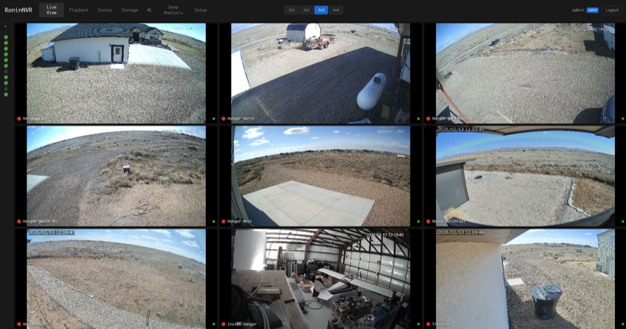
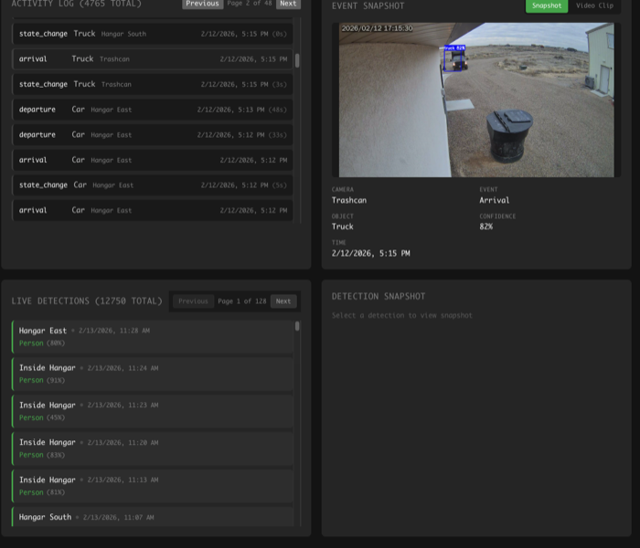
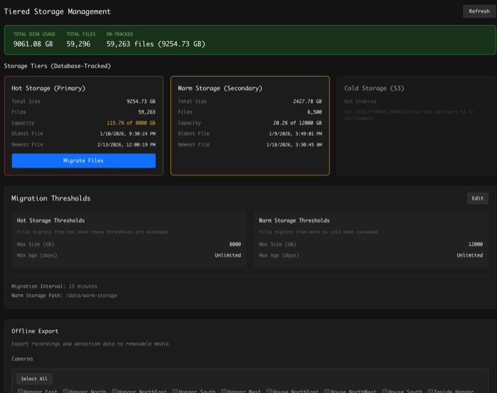
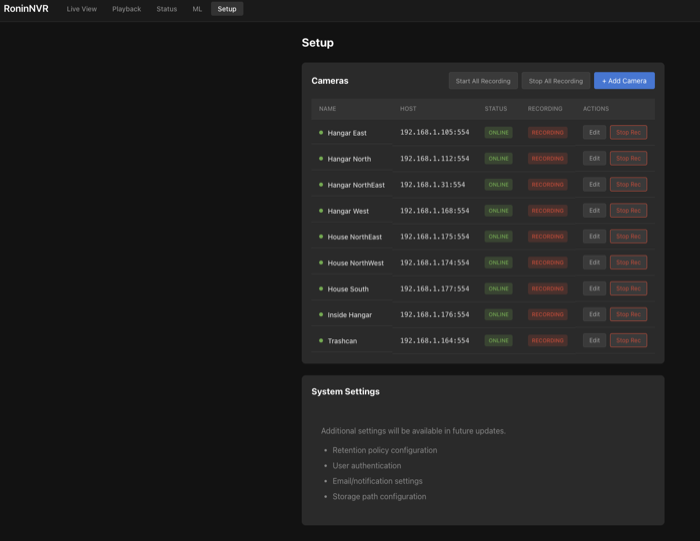
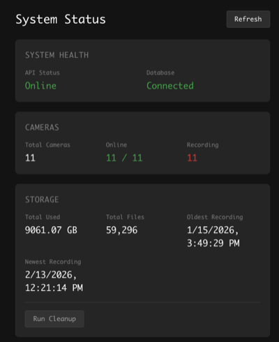
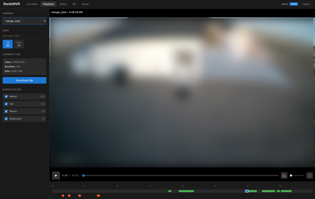
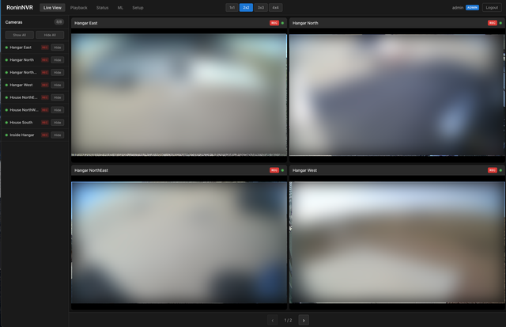
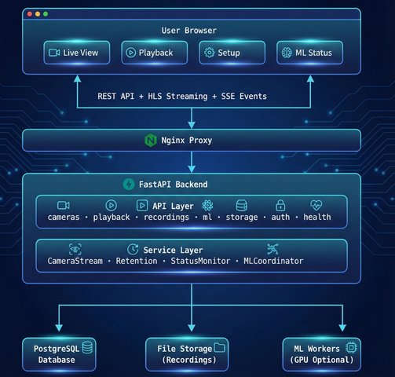

<p align="center">
  
</p>

<h1 align="center">Ronin NVR</h1>

<p align="center">
  A self-hosted Network Video Recorder with ML-powered object detection
</p>

---

Ronin NVR is a self-hosted Network Video Recorder designed to replace commercial surveillance systems. It provides multi-camera recording, live streaming, timeline-based playback, and intelligent object detection with activity tracking. The system is built with a Python/FastAPI backend, React frontend, and PostgreSQL database, all orchestrated via Docker with optional GPU acceleration.

**Key Capabilities:**
- 24/7 continuous recording from IP cameras via RTSP
- Low-latency live streaming (3-5 seconds) via HLS with audio toggle
- Calendar-based timeline playback with seeking and detection overlays
- YOLO-based object detection (people, vehicles, animals) with YOLO11 support
- Intelligent activity tracking with arrival/departure/state-change events
- Vision LLM integration for scene characterization
- Tiered storage management (hot/warm/cold) with automatic migration
- H.265 transcoding for storage optimization
- LLM-powered system watchdog for health monitoring
- Camera export/import and offline data export

---

## Screenshots

### Live View - Multi-Camera Grid

Real-time streaming from all cameras in a configurable grid layout with per-camera audio toggle, zoom controls, and detection indicators.



### ML Detection & Activity Log

Intelligent object detection with arrival/departure tracking, event snapshots with bounding boxes, and video clip extraction for each event.



### Tiered Storage Management

Hot/warm/cold storage tiers with configurable migration thresholds, capacity monitoring, and offline export to removable media.



### Camera Setup

Manage IP camera connections with RTSP validation, per-camera recording controls, and bulk start/stop operations.



### System Status

At-a-glance system health showing API status, camera connectivity, storage usage, and recording statistics.



### Playback & Timeline

Calendar-based date navigation with a 24-hour timeline ruler, color-coded detection markers, per-class event filtering, and clip download. Sidebar shows current clip metadata and detection counts by class.



### Live View with Camera Sidebar

Paginated camera grid with a collapsible sidebar for camera selection, show/hide toggles, and selectable grid layouts (1x1 through 4x4). Each cell shows recording status and camera name.



---

## System Architecture

### High-Level Component Diagram



### Technology Stack

| Layer | Technology |
|-------|------------|
| Frontend | React 19, TypeScript, Vite, HLS.js |
| Backend | Python 3.11+, FastAPI, SQLAlchemy 2.0 |
| Database | PostgreSQL 16+ with asyncpg |
| Video | FFmpeg 5.x, RTSP, HLS |
| ML | ONNX Runtime, YOLO11, OpenCV |
| Vision LLM | Activity characterization via LLM |
| Deployment | Docker, Docker Compose, Nginx |

---

## Core Subsystems

### 1. Camera Management

**Purpose:** Configure and manage IP camera connections.

**Location:** `backend/app/api/cameras.py`, `backend/app/services/camera.py`

**Responsibilities:**
- Store camera configurations (host, port, credentials, stream paths)
- Encrypt sensitive credentials at rest using Fernet encryption
- Validate RTSP connectivity before saving
- Provide camera status (online, offline, recording)
- Support camera grouping, ordering, and bulk export/import

### 2. Video Streaming

**Purpose:** Deliver live camera feeds to browsers with low latency.

**Location:** `backend/app/services/camera_stream.py`, `backend/app/services/streaming.py`

**Design Decision:** Each camera uses a single FFmpeg process with dual outputs -- one for live HLS streaming and one for MP4 recording. This avoids opening multiple RTSP connections to the same camera.

**Architecture:**
```
IP Camera (RTSP)
      |
      v
+---------------------------------------------+
|            FFmpeg Process                    |
|  Input: rtsp://camera/stream                |
|  +------------------+---------------------+ |
|  | Output 1: HLS    | Output 2: MP4       | |
|  | 2-sec segments   | 15-min segments     | |
|  | 10-seg playlist  | Continuous recording | |
|  +--------+---------+----------+----------+  |
+-----------|--------------------|--------------+
            v                    v
    .streams/{id}/        {Name}/{date}/
    +-- stream.m3u8       +-- HH-MM-SS.mp4
```

**Key Characteristics:**
- **Transmuxing only:** Copies video codec without re-encoding (low CPU)
- **Audio:** Transcodes to AAC for browser compatibility, per-camera audio toggle in UI
- **Auto-reconnect:** Exponential backoff with stream watchdog monitoring
- **Latency:** 3-5 seconds (2-second segments + buffering)

### 3. Recording System

**Purpose:** Continuously record camera streams to disk.

**Location:** `backend/app/services/recorder.py`, `backend/app/models/recording.py`

**Storage Organization:**
```
storage/
+-- {CameraName}/
|   +-- {YYYY-MM-DD}/
|       +-- 00-00-00.mp4   # 15-minute segments
|       +-- 00-15-00.mp4
|       +-- ...
+-- .streams/              # Live HLS segments (ephemeral)
```

**Workflow:**
1. FFmpeg writes continuous MP4 segments (default: 15 minutes)
2. On segment completion, metadata stored in database
3. Recording includes: start/end timestamps, file path, size, duration
4. Date rollover handling for long-running streams

### 4. Playback System

**Purpose:** Browse and view historical recordings with detection overlays.

**Location:** `backend/app/api/playback.py`, `backend/app/services/playback.py`

**Features:**
- Calendar-based date navigation
- 24-hour timeline visualization with consolidated view
- Click-to-seek within segments
- Object detection bounding box overlays on playback
- Cross-segment time range export
- HTTP range requests for efficient seeking

### 5. Tiered Storage Management

**Purpose:** Manage disk space across multiple storage tiers with automatic migration.

**Location:** `backend/app/services/retention.py`

**Storage Tiers:**
- **Hot Storage (Primary):** Fast local storage for active recordings
- **Warm Storage (Secondary):** Larger/slower storage for aging recordings
- **Cold Storage (S3):** Optional cloud archive (configurable)

**Policies:**
- **Age-based:** Migrate recordings older than N days to next tier
- **Size-based:** Migrate when storage exceeds threshold
- **Combined:** Apply both policies
- Configurable migration thresholds per tier
- Manual migration trigger and offline export to removable media

### 6. Authentication & Security

**Purpose:** Protect system access and secure stored credentials.

**Location:** `backend/app/api/auth.py`, `backend/app/services/auth.py`, `backend/app/services/encryption.py`

**Components:**
- **User authentication:** JWT tokens with configurable expiry
- **Credential encryption:** Fernet symmetric encryption for camera passwords
- **Rate limiting:** Prevent brute-force attacks
- **CORS:** Configured for frontend origin

---

## ML Detection System

### Overview

The ML system provides intelligent object detection and activity tracking through complementary modes:

| Mode | Purpose | Latency | Coverage |
|------|---------|---------|----------|
| Live | Real-time alerts and activity tracking | Seconds | Sampling at 1-2 fps |
| Historical | Analyze completed recordings | Minutes | Full coverage at 2 fps |

### Detection Features

- **YOLO11 support** with ONNX Runtime inference
- **Multi-GPU CUDA** support for parallel processing
- **Per-class confidence thresholds** configurable via UI
- **Motion pre-filtering** using background subtraction (MOG2) to skip static scenes
- **Arrival/departure tracking** via finite state machine -- distinguishes arriving objects from pre-existing stationary ones
- **Debounced notifications** to prevent alert spam
- **Event snapshots** with bounding box overlays and click-to-zoom lightbox
- **2x2 mosaic time sequences** for detection event context
- **Video clip extraction** for each detection event
- **JSON configuration** for detection pipeline settings

### Vision LLM Integration

**Purpose:** Provide natural-language scene characterization for detection events.

**Location:** `backend/app/services/ml/`

The system uses a Vision LLM to describe activity in detection snapshots, adding context beyond object class labels (e.g., "A delivery truck arriving at the east entrance").

### Activity Log

The ML page provides a comprehensive activity log with:
- Arrival, departure, and state-change events per camera
- Event duration tracking
- Paginated event history with snapshot previews
- Live detection feed with real-time updates

### ML Architecture

```
+---------------------------------------------------------------+
|                    ML Coordinator (FastAPI)                    |
|  - Creates jobs in database                                   |
|  - Monitors job status                                        |
|  - Provides API for status queries                            |
+------------------------------+--------------------------------+
                               | PostgreSQL NOTIFY
                               v
+---------------------------------------------------------------+
|                   Recording Watcher                            |
|  - Monitors completed recordings                              |
|  - Auto-queues for ML processing                              |
+------------------------------+--------------------------------+
                               |
        +----------------------+----------------------+
        v                                             v
+-------------------+                       +-------------------+
|  Historical       |                       |  Live Detection   |
|  ML Worker        |                       |  Worker           |
|                   |                       |                   |
|  - Processes MP4  |                       |  - Monitors HLS   |
|  - 2 fps analysis |                       |  - 1-2 fps        |
|  - Full coverage  |                       |  - FSM tracking   |
+-------------------+                       +-------------------+
        |                                             |
        +----------------------+----------------------+
                               v
                      +---------------+
                      |  Detections   |
                      |    Table      |
                      +---------------+
```

---

## Frontend Architecture

### Page Structure

| Page | Purpose | Key Components |
|------|---------|----------------|
| Live View | Real-time camera grid | CameraGrid, VideoPlayer, LayoutSelector, AudioToggle |
| Playback | Historical recording browser | Timeline, DatePicker, RecordingPlayer, DetectionOverlay |
| Setup | Camera configuration | CameraModal, connection testing, bulk controls |
| Status | System health overview | Storage stats, camera status, tiered storage management |
| ML | Detection monitoring | Activity log, event snapshots, live detection feed, config |
| Login | Authentication | JWT token management |

### Component Hierarchy

```
App
+-- AuthContext (authentication state)
+-- Header (navigation, user menu)
+-- Routes
|   +-- LiveViewPage
|   |   +-- CameraSidebar (camera list)
|   |   +-- LayoutSelector (grid layout)
|   |   +-- CameraGrid
|   |       +-- VideoPlayer (HLS.js)
|   |       +-- AudioToggle
|   +-- PlaybackPage
|   |   +-- DatePicker
|   |   +-- Timeline (consolidated)
|   |   +-- RecordingPlayer
|   |   +-- DetectionOverlay (bounding boxes)
|   +-- SetupPage
|   |   +-- CameraModal
|   +-- StatusPage
|   |   +-- SystemHealth
|   |   +-- TieredStorageManagement
|   |   +-- OfflineExport
|   +-- MLStatusPage
|   |   +-- ActivityLog
|   |   +-- EventSnapshot (mosaic, video clips)
|   |   +-- LiveDetections
|   |   +-- DetectionConfig
|   +-- LoginPage
```

**Location:** `frontend/src/`

### State Management

- **AuthContext:** Global authentication state, JWT handling
- **useCameras hook:** Camera list with periodic polling
- **Local state:** Grid layout preferences (persisted to localStorage)
- **API client:** Axios with automatic token injection

### Video Playback

**Library:** HLS.js

**Configuration:**
- Low-latency mode for live view
- Buffer tuning for smooth playback
- Auto-quality selection
- Reconnection on errors

---

## Deployment Architecture

### Docker Services

```
+-------------------------------------------------------------+
|                     docker-compose.yml                       |
+-------------------------------------------------------------+
|                                                              |
|  +--------------+  +--------------+  +--------------+        |
|  |   postgres   |  |   backend    |  |   frontend   |        |
|  |  (database)  |<-|  (FastAPI)   |<-|   (Nginx)    |<------ |
|  +--------------+  +--------------+  +--------------+        |
|         ^                 ^                                   |
|         |                 |                                   |
|  +------+-----------------+--------------------------+       |
|  |                  Shared Volumes                   |       |
|  |  - /data/storage (recordings)                     |       |
|  |  - /data/warm-storage (warm tier)                 |       |
|  |  - /data/ml_models (ONNX models)                  |       |
|  +---------------------------------------------------+       |
|         ^                 ^                                   |
|  +------+-----+    +------+-----+    +--------------+        |
|  |   live-    |    |  ml-worker |    |  transcode-  |        |
|  | detection  |    | (optional) |    |    worker    |        |
|  +------------+    +------------+    +--------------+        |
|                                                              |
+--------------------------------------------------------------+
```

### Service Responsibilities

| Service | Purpose | GPU |
|---------|---------|-----|
| postgres | Database persistence | No |
| backend | API, streaming, coordination, watchdog | Optional |
| frontend | Static assets, reverse proxy | No |
| live-detection | Real-time detection and activity tracking | Yes |
| ml-worker | Historical detection (optional profile) | Yes |
| transcode-worker | H.265 conversion | Yes |

### Configuration

Primary configuration via environment variables:

| Category | Key Variables |
|----------|---------------|
| Database | DATABASE_URL |
| Storage | STORAGE_ROOT, RETENTION_DAYS, RETENTION_MAX_GB |
| Warm Storage | WARM_STORAGE_PATH, WARM_STORAGE_MAX_GB |
| Security | JWT_SECRET_KEY, ENCRYPTION_KEY |
| ML | ML_ENABLED, ML_CONFIDENCE_THRESHOLD, ML_CLASS_FILTER |
| Live Detection | LIVE_DETECTION_ENABLED, LIVE_DETECTION_FPS, LIVE_DETECTION_COOLDOWN |

---

## Quick Start

```bash
# Clone and configure
git clone <repo-url>
cd ronin-nvr
cp .env.example .env
# Edit .env with your settings (JWT_SECRET_KEY, ENCRYPTION_KEY, etc.)

# Start all services (GPU)
docker compose up -d

# Or CPU-only mode
docker compose -f docker-compose.cpu.yml up -d

# Access the web interface
open http://localhost

# View logs
docker compose logs -f backend
```

See [CLAUDE.md](CLAUDE.md) for detailed Docker commands, database migrations, and development setup.

---

## File Reference

| Component | Key Files |
|-----------|-----------|
| Camera streaming | [camera_stream.py](backend/app/services/camera_stream.py) |
| HLS generation | [streaming.py](backend/app/services/streaming.py) |
| Recording playback | [playback.py](backend/app/services/playback.py) |
| Storage retention | [retention.py](backend/app/services/retention.py) |
| ML inference | [detection_service.py](backend/app/services/ml/detection_service.py) |
| ML coordination | [coordinator.py](backend/app/services/ml/coordinator.py) |
| Live detection | [live_detection_worker.py](backend/live_detection_worker.py) |
| Frame extraction | [frame_extractor.py](backend/app/services/ml/frame_extractor.py) |
| Motion detection | [motion_detector.py](backend/app/services/ml/motion_detector.py) |
| Frontend API | [api.ts](frontend/src/services/api.ts) |
| Live view grid | [CameraGrid.tsx](frontend/src/components/CameraGrid.tsx) |
| Playback UI | [PlaybackPage.tsx](frontend/src/pages/PlaybackPage.tsx) |
| ML status UI | [MLStatusPage.tsx](frontend/src/pages/MLStatusPage.tsx) |
| Docker config | [docker-compose.yml](docker-compose.yml) |

---

## License

[MIT](LICENSE)
